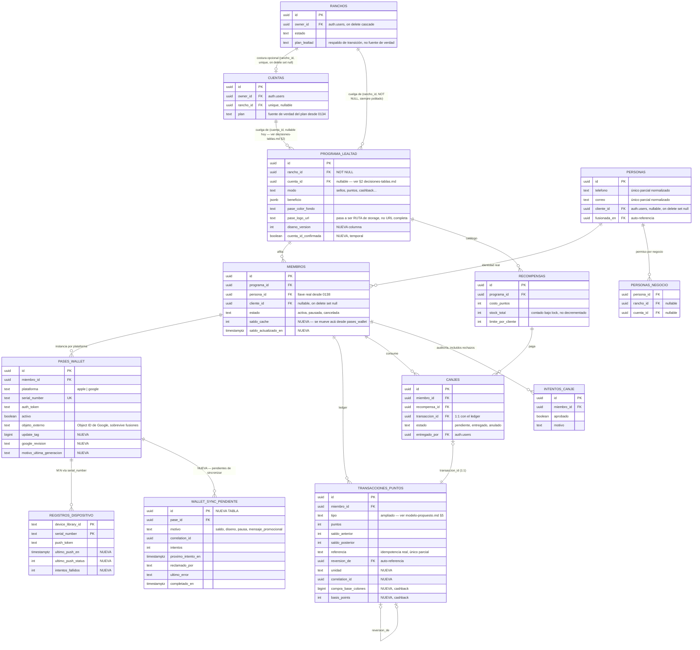

# ERD — Wallet V2

> **Actualización Fase 2B**: implementado tal cual. `WALLET_SYNC_PENDIENTE`
> se llama, en el esquema real, `wallet_sincronizaciones` — ver
> `fase-2b-resultado.md`.

> Estado propuesto. Las tablas marcadas `NUEVA` no existen todavía; el
> resto ya existe y solo gana columnas (ver `modelo-propuesto.md` para el
> detalle exacto). `ranchos` se incluye por la costura con `cuentas`, no
> porque Wallet V2 la modifique.

## Lectura del diagrama

- **Dos padres de `programa_lealtad`** (`rancho_id` siempre, `cuenta_id` a
  veces) son intencionalmente ambos visibles — es el hallazgo central de
  la Fase 2A, no un error de diagramación. Cualquier código nuevo debe
  tratar `cuenta_id` como opcional hasta que el backfill de producto se
  confirme.
- `PASES_WALLET` ya no tiene columna de saldo en este diagrama — se
  movió a `MIEMBROS` (§4 de `decisiones-tablas.md`).
- `WALLET_SYNC_PENDIENTE` es la única entidad nueva de todo el diagrama.
- `REGISTROS_DISPOSITIVO` se dibuja M:N con `PASES_WALLET` a través de
  `serial_number` (no hay FK de objeto directa en el modelo actual, es
  una relación por valor — se mantiene así, ya funciona).
